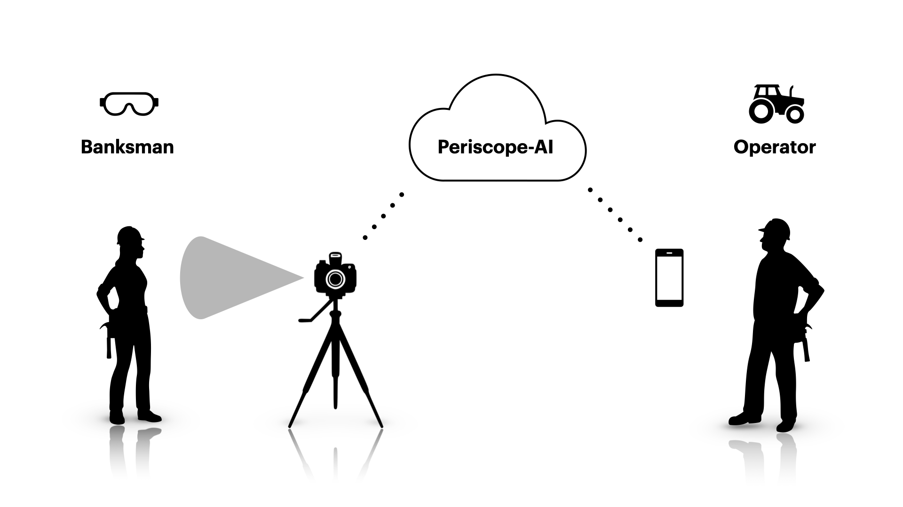
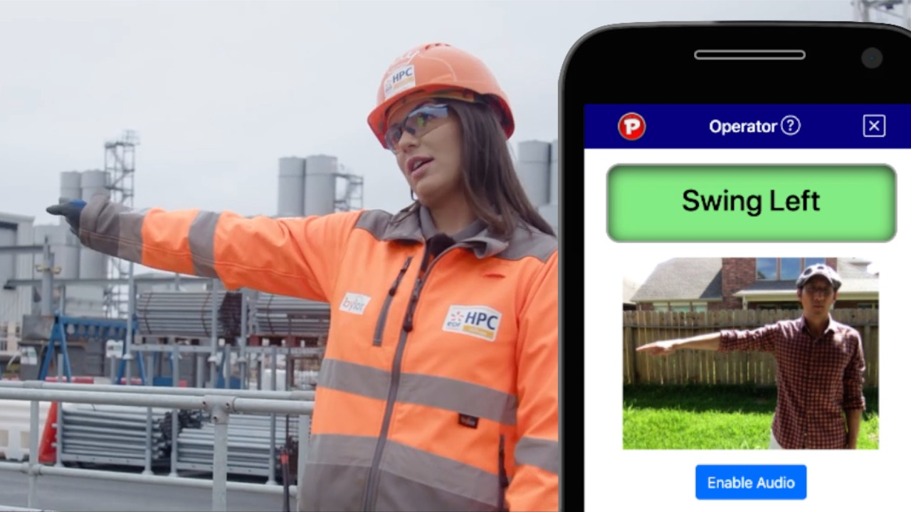
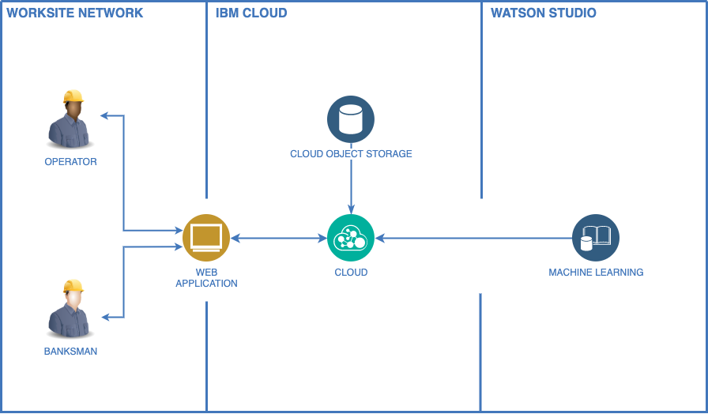

# Periscope-AI

[](https://www.apache.org/licenses/LICENSE-2.0)

```
NOTE: As of August 25, 2021, the ML API is temporarily offline for both the local test and the demo site while we redesign the service for sustainability. P2P video stream remains unaffected.
```

## Table of Contents

- [What is the problem?](#what-is-the-problem)
- [How can technology help?](#how-can-technology-help)
- [Demo video](#demo-video)
- [The architecture](#the-architecture)
- [Project roadmap](#project-roadmap)
- [Instructions](#test-instructions)
- [Live demo](#live-demo)
- [Built with](#built-with)
- [Contributing](#contributing)
- [Authors](#authors)
- [License](#license)

## What is the problem?

Most worksite accidents are attributed to equipment failure caused by human error.

Construction sites, oil rigs and seaports are rife with workers who experience transportation accidents, collision with heavy machinery and more - from factors such as poor visibility, obstructions, blindspots, misoperation and simple misinterpretations.

The accidents are both tragic for the victims and costly for the projects due to insurance hikes, lawsuits, delays, and loss of work.

Some notable annual statistics in the U.S. are:

- 200,000 injuries in construction sector alone <sup>[BLS](https://www.bls.gov/iif/soii-charts-2018.pdf)</sup>
- Fatality for 10 out of every 100,000 workers <sup>[BLS](https://www.bls.gov/charts/census-of-fatal-occupational-injuries/number-and-rate-of-fatal-work-injuries-by-industry.htm)</sup>
- Cost of construction injuries reported at $11.5 billion <sup>[NIH](https://www.ncbi.nlm.nih.gov/pmc/articles/PMC2491397/#:~:text=Construction%20injuries%20cost%20%2411.5%20billion,with%20days%20away%20from%20work.)<sup>
- 840,000 blind spot accidents and 300 deaths, many involving large trucks <sup>[NHTSA](https://crashstats.nhtsa.dot.gov/Api/Public/ViewPublication/811144)</sup>

## How can technology help?

Most such accidents can be prevented with watchful execution and improved communication.

Machine learning and computer vision can provide a second set of eyes - both figuratively and literally.

Tech-enabled communication between workers can reduce human error in existing means of communication. For instance, concurrent transmission of signaled messages can minimize reliance on a clear line of sight between a banksman and an operator of heavy machinery.

## The idea

The app supplies a heavy equipment operator with a supplementary channel of visual signals from a source such as a banksman.



Once the app is set up and the personnel are situated:

1. Banksman begins a video broadcast of gestures via the app
2. App transmits snapshots of gestures to remote ML model
3. Model provides prediction based on the images
4. App delivers video feed and prediction to the operator

## Demo video

[](https://youtu.be/iWljsPrJ5f4)

## The architecture



## Project roadmap

The project currently provides:

- One-to-many live broadcast of a video stream
- Processing and classification of static images
- Snapshot inteval of 3-5 seconds per ML API's limitations
- Machine Learning prediction for 4 OSHA hand gestures (Boom Up/Down; Swing Left/Right)

As part of our future scope, we propose to:

- Improve browser compatibility
  - Add getImageData fallbacks for Safari and Firefox
- Develop video classification framework for better performance
  - Real-time measurements and predictions
  - Motion/differential tracking
- Add means of output
  - Auditory (audio clip, text-to-speech)
  - Graphical
- Open up to pretrained models
  - Internalized model to avoid network calls to API
  - Custom training for ability to swap or edit model
- Add compatibility with other data sources
  - Mobile app
  - Drone interface
  - CCTV interface
  - Public camera stream
  - Sensor-enabled interface (e.g. glove, headset)
- Expand applicability via training in new contexts
  - Maritime/nautical signals (flag, light, shape)
  - Sign languages
  - Virtual training
  - Self-driving protocol

## Test instructions

```
NOTE: As of August 25, 2021, the ML API is temporarily offline for both the local test and the demo site while we redesign the service for sustainability. P2P video stream remains unaffected.
```

### Set up the application

1. Clone the repository and install dependencies for Node.js.

   ```
   git clone https://github.com/Manchukonda/Periscope-AI.git
   npm install
   ```

2. Start the server. (In localhost, default port is 4000)
   ```
   npm start
   ```

### Usage (Banksman)

1. Open the app in Banksman View (e.g. `https://localhost:4000/broadcast.html`) on a device connected to the server's network.
2. Invite operator to open the app in Operator View. (e.g. `https://localhost:4000`).
3. Place the camera in front to capture your full upper body.
4. Communicate signals.

### Usage (Operator)

1. Open the app (e.g. `https://localhost:4000/`) on a device connected to the server's network.
2. Wait to connect with the banksman.
3. Receive signals from banksman.

## Live demo

```
NOTE: As of August 25, 2021, the ML API is temporarily offline for both the local test and the demo site while we redesign the service for sustainability. P2P video stream remains unaffected.
```

- Banksman: https://periscope-ai.herokuapp.com/broadcast.html

- Operator: https://periscope-ai.herokuapp.com/

## Built with

- [Socket.io](https://socket.io/) - Peer-to-peer communication on front end
- [IBM Watson Studio](https://cloud.ibm.com/catalog?search=watson%20machine%20learning#search_results) - Training through Machine Learning
- [IBM Cloud Object Studio](https://cloud.ibm.com/catalog?search=cloud%20object%20storage#search_results) - Cloud storage

## Contributing

Please read [CONTRIBUTING.md](CONTRIBUTING.md) for details on our code of conduct, and the process for submitting pull requests to us.

## Authors (alphabetical) <a name="authors"></a>

- [Chukwunonso Richard Iwenor](https://github.com/RichardTalented) <sup>[email](mailto:nonsoiwenor@gmail.com)</sup>
- [Danny Kim](https://github.com/danninemx) <sup>[email](mailto:danny.kim@cognizant.com)</sup>
- [Harish Kumar Manchukonda](https://github.com/Manchukonda) <sup>[email](mailto:manchukonda.harish548@gmail.com)</sup>
- [Jaiswal Felipe](https://github.com/JaiswalFelipe) <sup>[email](mailto:jfprofacc@gmail.com)</sup>

## License

This project is licensed under the Apache 2 License - see the [LICENSE](LICENSE) file for details.
